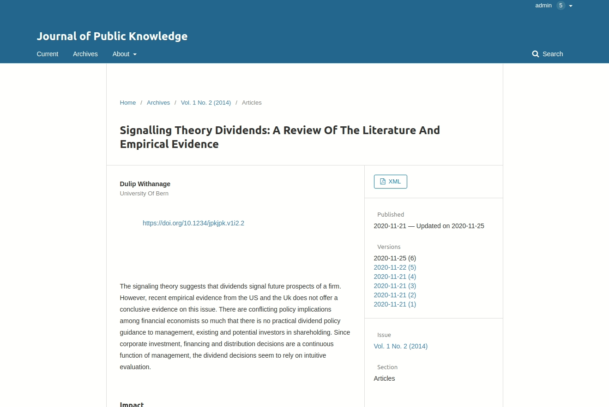

# Table of Contents


## Research Organization Registry(ROR) Plugin

OJS 3 Plugin for adding  Organization names  for author affiliations provided by  [ROR.org](https://ror.org/)
Organizations maintained by ROR.org are automatically fetched using an auto suggesting function.
For multilingual journals, additionally supported languages will be pre-filled  given, [ROR.org](https://ror.org/) has the corresponding names in the OJS supported languages.

[Open Access Publication Platform](https://www.tib.eu/en/publishing-archiving/open-access/repositories/open-access-publication-platform), [TIB, Hannover, Germany](https://www.tib.eu/)  maintains  this Plugin and  supports its long-term compatibility by adding features and guaranteeing OJS compatibility.

Licensed under GPLv3. See [LICENSE](LICENSE) for details.

## User Documentation
* Adding the ROR organization name into your author affiliation.
* 


## Installation
 1. Login as admin or Journal manager
 1. Select _Settings -> Website -> Plugins_
 1. Click On _Plugin Gallery_
 1. Select and click on _ROR Plugin_
 1. Click _Install_ in the opened modal and wait for the _installation_ to finish.
 1.  Click on _Enable_ button . ROR Plugin is installed under generic plugins.

**This step is _`only`_ required, if your OJS 3.2 is prior to `30.11.2020` or  your are _`not`_ using `default theme`**

 *  Select _templates/frontend/objects/article_details.tpl_
 *   Find the following code in the template.
 ```xml
<span class="affiliation">
    {$author->getLocalizedData('affiliation')|escape}
</span>
```
*  Add the ROR Icon template varible
```xml
<span class="affiliation">
    {$author->getLocalizedData('affiliation')|escape}
    {if $author->getData('rorId')}
        <a href="{$author->getData('rorId')|escape}">{$rorIdIcon}</a>
    {/if}
</span>
```


## Features

### Release 1.0

* Allows auto-suggesting organization names
* Pre-fills  affiliations in multilingual context
* Subsequent alteration of the ROR-suggested organization name is also possible by maintaining the ROR Plugin, wich can be helpful in special cases e.g. adding a institute name for a research organization.

### Release 2.0
* Support for user affiliations
* OJS 3.3 compatibility
* Usability requests

### Release 3.0

* Multilingual organization support


## Credits

## Development
* [Dulip Withanage](https://www.github.com/withanage)

## Specification
  [Paul Vierkant](https://github.com/paulvierkant)


